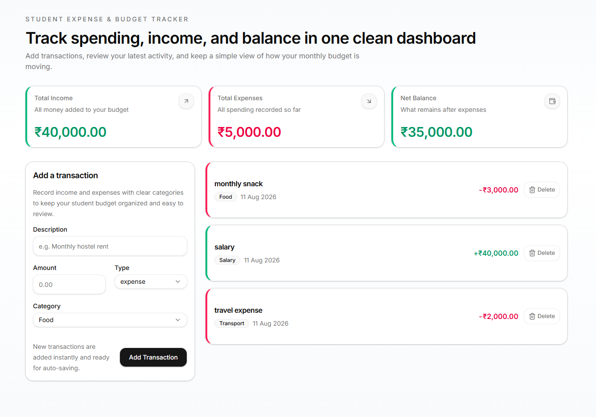

# Student Expense & Budget Tracker

A clean, responsive dashboard for students to track income, expenses, and their running balance — built as part of a technical assignment.



## Live Demo

[View the live app →](https://student-expense-tracker-nine-jade.vercel.app/)

## Features

- **Real-time summary cards** — Total Income, Total Expenses, and Net Balance, recalculated automatically from the transaction list.
- **Add transactions** — description, amount, type (income/expense), and category, with inline validation (amount must be a positive number, description can't be empty).
- **Transaction list** — color-coded by type, newest first, with a one-click delete.
- **Persistence** — transactions are saved to `localStorage`, so data survives a page refresh.
- **Responsive & accessible** — usable from mobile width up, with keyboard-accessible focus states and visible hover states throughout.

## Tech Stack

- [Next.js](https://nextjs.org/) (App Router)
- React.js
- TypeScript
- Tailwind CSS
- [shadcn/ui](https://ui.shadcn.com/) for base components (Card, Button, Input, Select)

## Project Structure

```
app/            → page.tsx (composes the dashboard, no business logic)
components/     → SummaryCards, TransactionForm, TransactionList, TransactionItem, EmptyState
components/ui/  → shadcn-generated primitives
hooks/          → useTransactions.ts (state management + persistence)
services/       → storage.ts (localStorage layer, isolated from UI)
utils/          → formatCurrency.ts, validators.ts
types/          → transaction.ts
```

## Getting Started

```bash
git clone https://github.com/mohd-hassan17/student-expense-tracker.git
cd student-expense-tracker
npm install
npm run dev
```

Open [http://localhost:3000](http://localhost:3000) in your browser.

## Data Model

```ts
type Transaction = {
  id: string;
  description: string;
  amount: number;
  type: 'income' | 'expense';
  category: string;
  date: string;
};
```

## Data Persistence

Transactions are stored in the browser's `localStorage` under the key `student-expense-tracker:transactions`. No backend or database is used — `services/storage.ts` is the single place that reads from and writes to storage, so no component accesses `localStorage` directly. Swapping in a real API later would only require changing that one file.

## AI Usage

Generative AI tools (OpenAI Codex and Claude) were used to accelerate development, explore implementation approaches, and troubleshoot issues. All generated code was reviewed, tested, modified where necessary, and fully understood before submission.
